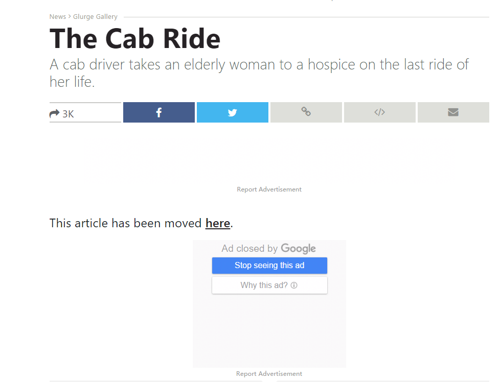
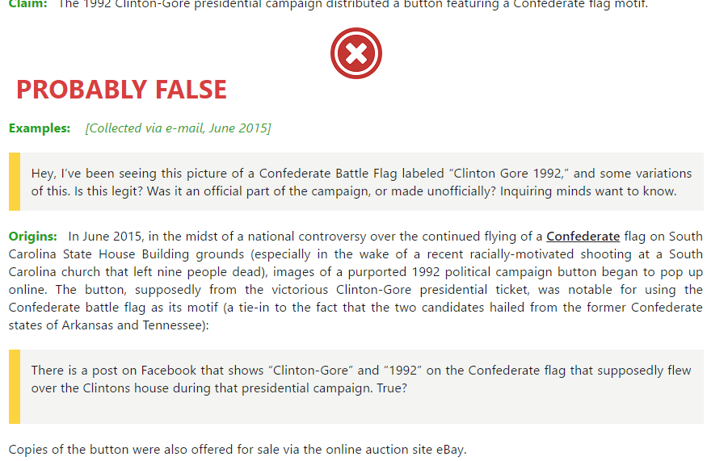
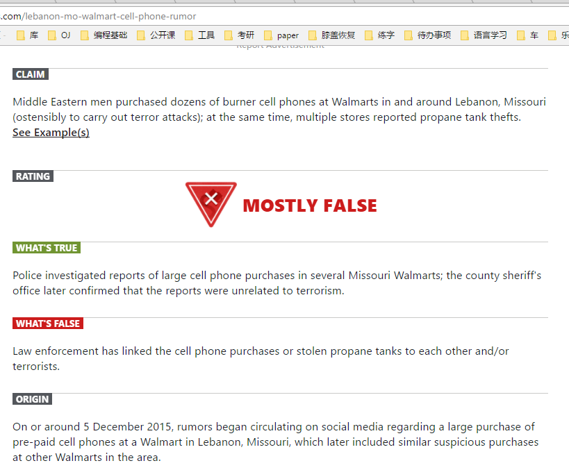
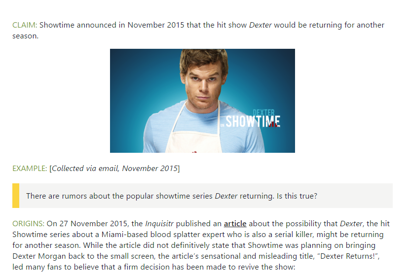
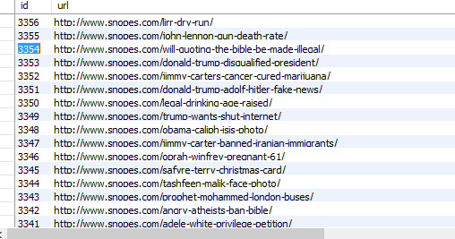
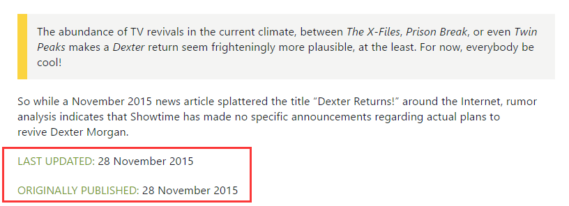
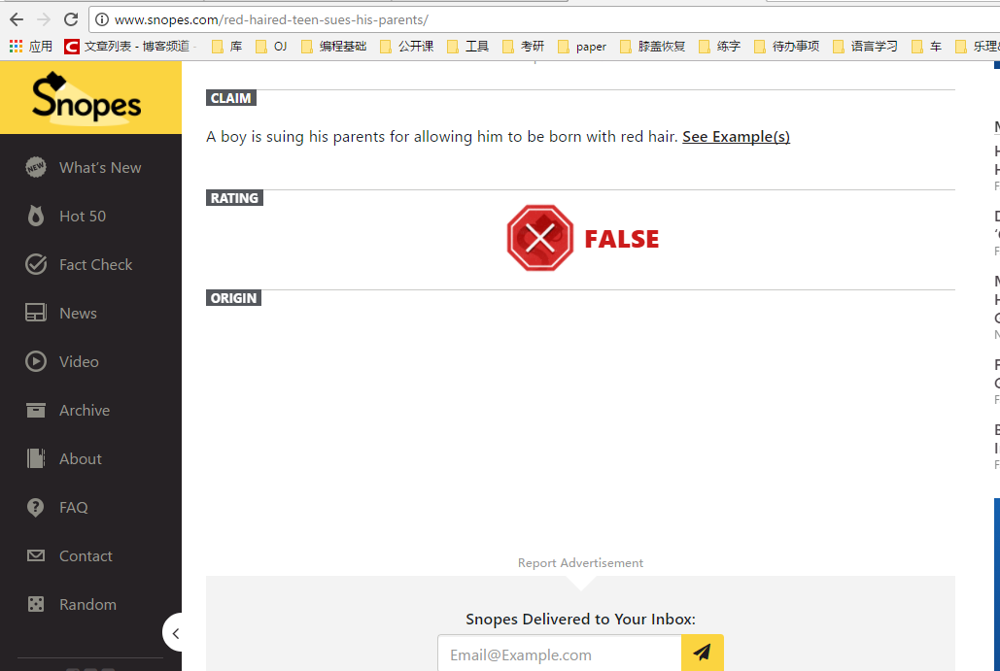

- 文章中可能因为包含有 emoji 表情，所以需要在存入数据库时使用utf8mb4保存，可以保存四位编码的数据。

- 文章的内容可能已经被迁移。部分文章内容其实是"此文章请转至***url"，还需要再清理文章content只是url的部分，而且需要判断链接的url是否已经被采集过了，例子如下：经过`select * from db_snopes.tb_snopes where content like '%This article has been moved here%' or content like '%This page has been moved here%';` 筛选出了部分页面请见[表格](./content是链接的页面.xlsx)。

- 文章中可能包括多个时间，大部分都包含有 published time。时间的例子如下：
  `Published:Sep 11th, 2015`,`Updated:Sep 11th, 2015`，部分文章没有description、sources、claim、rating、tag。

- 没有抓取WHAT'S TRUE、WHAT'S FALSE，还有早期样式中部分文章包含example，summary也没有抓取。

  example与origin同时出现的例子：这里面的example没有抓取。

- 板式主要分为以下几种：

  1. http://www.snopes.com/lebanon-mo-walmart-cell-phone-rumor

  

  >注意 claim、origin部分的样式。

  2. http://www.snopes.com/showtime-dexter-returns-rumor/

  

  > 样式有一些变化。第二版的claim好像没有特别明显的标志来判断，最终使用的判断规则是：p标签的开头是'Claim:'。还有rating、content之类的也是使用的类似的方法来判断的。采用第二版样式的第一个页面id 大概是3300+左右：

  
  同时可以发现在正文结尾处经常会带有一个 date 信息：

  

  在数据库 id ∈ (3300, 9400) 有部分页面content中的Last update、Originally posted等内容，以及其后的没有意义的内容没有被清理掉。**可以继续清理**

- 利用 bind 的方法来update数据库会因为未知原因失败，后改用字符串操作数据库（不专业，可以注入攻击)

- 有些页面本身是有问题的

  origin下没有内容[链接](http://www.snopes.com/red-haired-teen-sues-his-parents/)

  - http://www.snopes.com/red-haired-teen-sues-his-parents/ origin之下没有实际内容
  - http://www.snopes.com/cetacean-harvestation/  只有example，没有origin
  - http://www.snopes.com/crime-waco-motorcycles/ 只有example，没有origin

- page need to revise.txt 中含有content抓取失败的几十个页面的url。还可以进一步优化的是rating，很多页面的rating没有成功抓取到。 